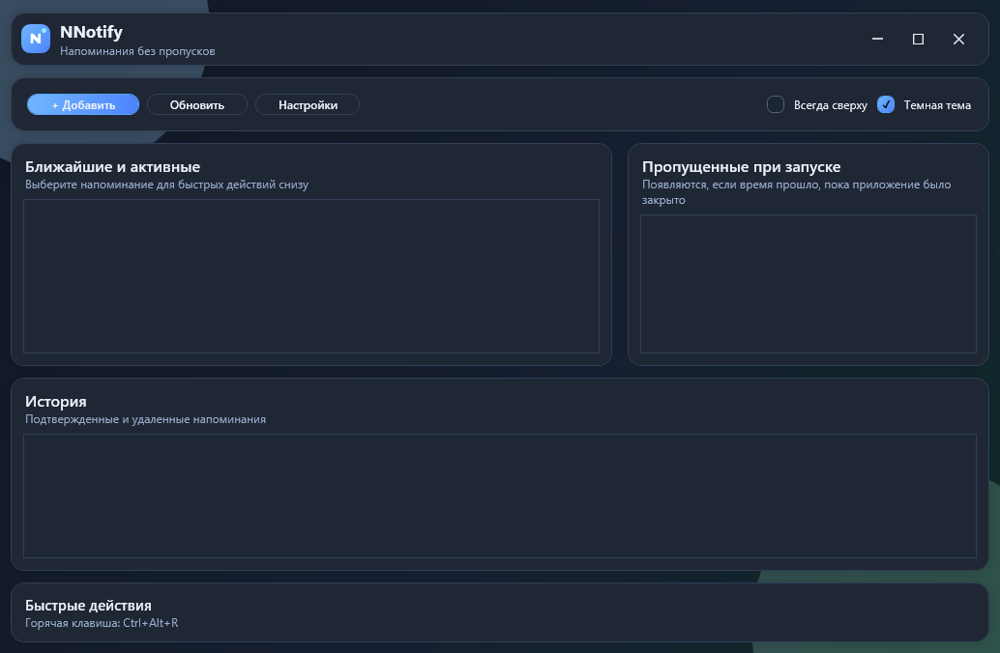
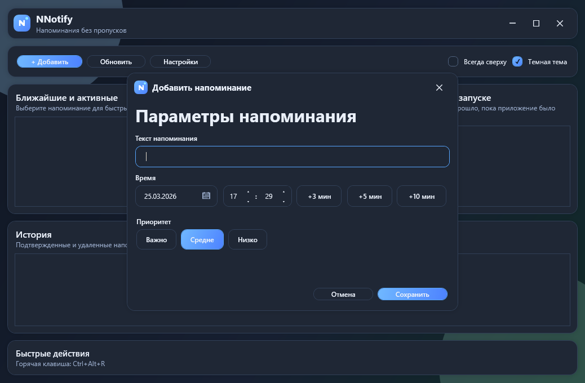
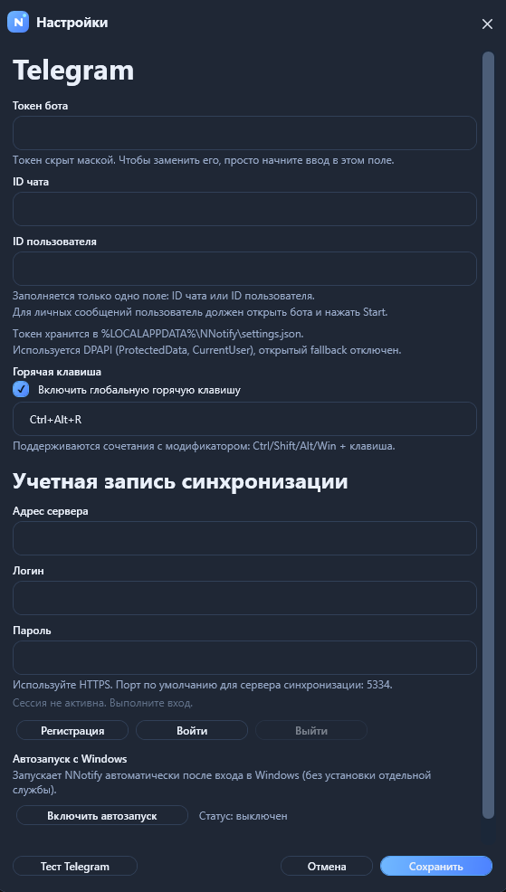

# NNotify

NNotify — десктопное приложение напоминаний для Windows (WPF).
Приложение помогает не пропускать задачи: хранит их локально, показывает оверлей-уведомления и при необходимости отправляет эскалацию в Telegram.

## Скриншоты

### Главное окно


### Добавление напоминания


### Настройки


## Возможности

- Локальные напоминания с датой, временем и приоритетом.
- Быстрые кнопки времени: `+3`, `+5`, `+10` минут.
- Списки: ближайшие, пропущенные при запуске, история.
- Оверлей с подтверждением/переносом/удалением.
- Эскалация в Telegram, если напоминание пропущено на ПК.
- Глобальная горячая клавиша для быстрого вызова.
- Автозапуск вместе с Windows.
- Светлая и темная темы.

## Технологии

- .NET 8
- WPF
- SQLite (`Microsoft.Data.Sqlite`)

## Требования

- Windows 10/11 x64
- .NET Desktop Runtime 8.0 (для framework-dependent сборки)

## Быстрый старт (из исходников)

```powershell
cd C:\NNotify_v3\NNotify
dotnet restore
dotnet run
```

## Сборка Release

```powershell
cd C:\NNotify_v3\NNotify
dotnet build NNotify.csproj -c Release
```

## Публикация одним EXE (рекомендуется)

В проекте настроена публикация в один файл без встраивания runtime.

```powershell
cd C:\NNotify_v3\NNotify
.\Publish-SingleExe.ps1
```

Результат:

- `artifacts\singlefile\NNotify.exe`
- размер обычно около `2.8–3.0 MB`

## Настройка Telegram

1. Откройте `Настройки`.
2. Укажите `Токен бота`.
3. Заполните только одно поле: `ID чата` или `ID пользователя`.
4. Нажмите `Тест Telegram` для проверки отправки.

## Хранение данных и безопасность

- Настройки пользователя хранятся локально в `%LOCALAPPDATA%\NNotify\settings.json`.
- Чувствительные значения (например, токен Telegram) шифруются через DPAPI (`CurrentUser`).
- Логи приложения: `%LOCALAPPDATA%\NNotify\log.txt`.

## Структура проекта

```text
Assets/          Ресурсы приложения (иконки, звук)
Data/            Репозиторий и работа с локальными данными
Localization/    Локализация (resx)
Models/          Модели домена
Native/          Нативная интеграция (горячие клавиши)
Services/        Бизнес-логика и фоновые сервисы
Windows/         XAML-окна приложения
Server/          Серверный модуль (отдельная часть проекта)
```

## Для разработчиков

Перед коммитом рекомендуется:

```powershell
dotnet build NNotify.csproj -c Release
```

И проверка, что в git не попали артефакты/секреты:

```powershell
git status --short
```
