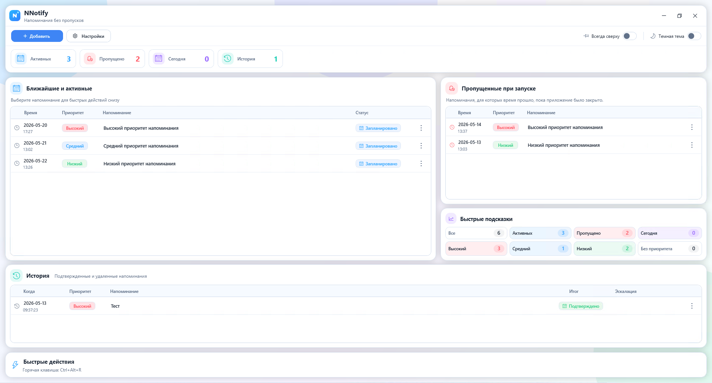
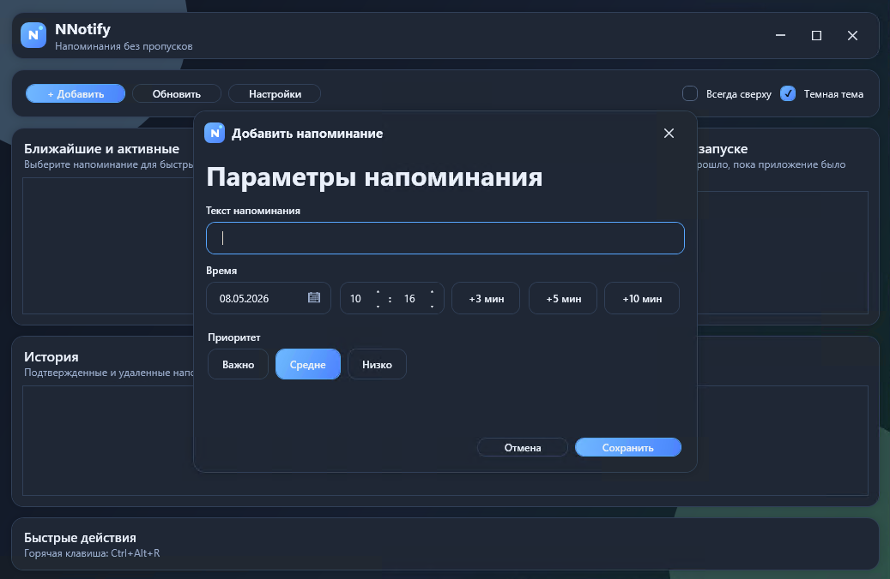
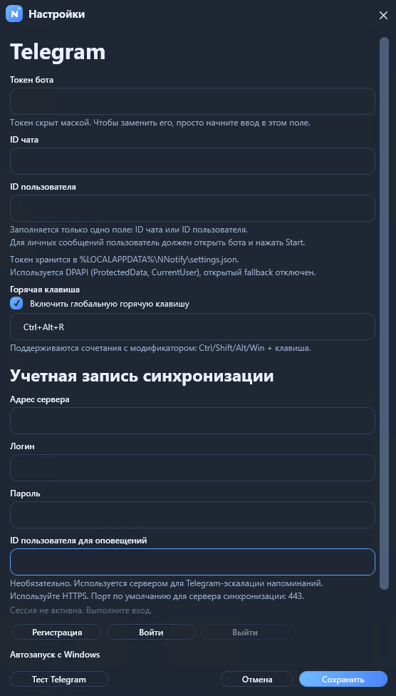
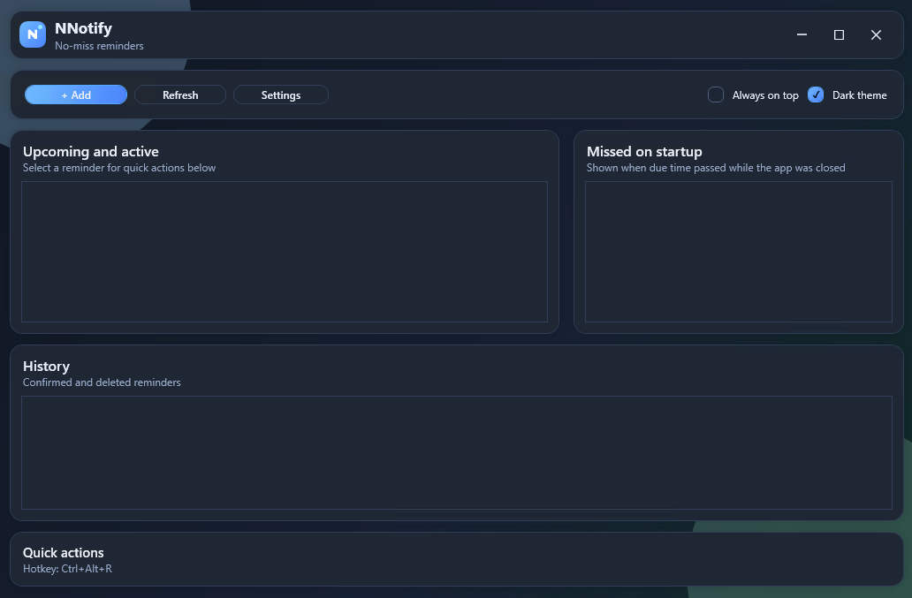
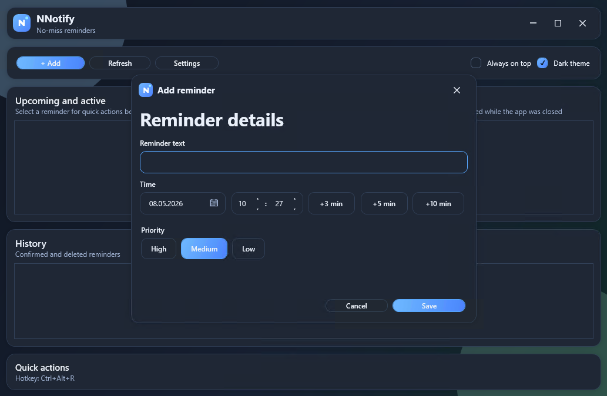
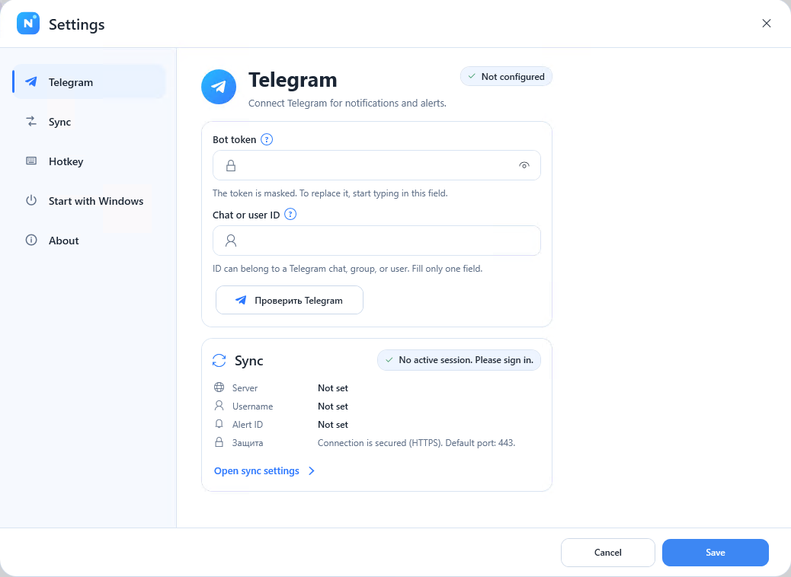

# NNotify

[Русская версия](#ru) | [English Version](#en)

---

<a id="ru"></a>
## Русская версия

**Быстрые ссылки:**
[Описание](#ru-overview) | [Возможности](#ru-features) | [Web/PWA](#ru-pwa) | [Синхронизация](#ru-sync) | [Telegram](#ru-telegram) | [Безопасность](#ru-security) | [Требования](#ru-requirements) | [Запуск](#ru-run) | [Сборка](#ru-build) | [Сервер](#ru-server)

<a id="ru-overview"></a>
### Описание

**NNotify** — легкое приложение напоминаний для Windows с синхронизацией, Telegram-эскалацией и web/PWA-доступом.

Оно помогает не пропускать задачи: показывает заметное overlay-уведомление, позволяет подтвердить или отложить напоминание, хранит историю и при необходимости отправляет эскалацию в Telegram.

Начиная с `v3.0.0`, NNotify включает обновленный Windows-клиент, сервер синхронизации и web/PWA-интерфейс для работы с напоминаниями из браузера или с телефона.

NNotify умеет работать в двух режимах:

- **Локальный режим** — все напоминания хранятся только на текущем ПК.
- **Серверный режим** — напоминания синхронизируются между Windows-клиентом, web-версией и мобильной PWA через NNotify Sync Server.

<a id="ru-screenshots"></a>
### Скриншоты

**Главное окно**



**Добавление напоминания**



**Настройки**



<a id="ru-features"></a>
### Возможности клиента

- Напоминания с датой, временем, текстом и приоритетом.
- Приоритеты: `Высокий`, `Средний`, `Низкий`.
- Быстрые кнопки времени: `+3`, `+5`, `+10` минут.
- Удобный выбор даты и времени.
- Разделы: ближайшие, пропущенные при запуске, история.
- Overlay-окно поверх рабочих окон.
- Действия из overlay: подтвердить, отложить на 5 минут, отложить на 15 минут, изменить.
- Звуковое уведомление при срабатывании.
- Глобальная горячая клавиша для быстрого добавления напоминания.
- Автозапуск вместе с Windows.
- Светлая и темная темы.
- Полностью обновленный интерфейс Windows-клиента.
- Современные окна настроек, добавления и редактирования напоминаний.
- Проверка наличия новой версии через GitHub Releases.
- Интерфейс на русском, английском и немецком языках.
- Работа из системного трея.
- Защита от запуска нескольких копий приложения.

<a id="ru-pwa"></a>
### Web/PWA

NNotify v3.0.0 добавляет web-интерфейс и мобильную PWA-версию.

PWA работает только через серверный режим и использует уже созданную учетную запись синхронизации. Регистрация в PWA не выполняется.

В web/PWA можно:

- войти под учетной записью NNotify Sync Server;
- создавать напоминания;
- подтверждать, откладывать, редактировать и удалять напоминания;
- просматривать ближайшие напоминания и историю;
- синхронизировать изменения с Windows-клиентом.

На iOS PWA можно добавить на экран “Домой” через меню браузера: `Поделиться` → `На экран “Домой”`.

<a id="ru-sync"></a>
### Серверная синхронизация

Синхронизация опциональна. Если сервер не настроен, NNotify продолжает работать как полностью локальное приложение.

Если включить sync-аккаунт, приложение умеет:

- синхронизировать напоминания между несколькими ПК;
- синхронизировать напоминания между Windows-клиентом, web-версией и PWA;
- объединять локальные напоминания при первом подключении учетной записи;
- синхронизировать активные, пропущенные и исторические записи;
- отмечать похожие напоминания как возможные дубли;
- применять подтверждение/отложку/удаление на других устройствах;
- продолжать работать локально при временной потере сети и досинхронизировать изменения позже.

Серверная часть находится в каталоге `server/`.
Web/PWA-файлы находятся в каталоге `server/web/`.

<a id="ru-telegram"></a>
### Telegram

NNotify поддерживает два варианта Telegram-эскалации:

- **Локальная эскалация** — клиент сам отправляет сообщение через указанного бота.
- **Серверная эскалация** — сервер отправляет сообщение, даже если клиент на ПК выключен.

Для личных сообщений пользователь должен открыть соответствующего Telegram-бота и нажать `Start`. Это ограничение Telegram Bot API: бот не может написать пользователю первым.

#### Как подготовить Telegram-бота

1. Откройте `@BotFather` в Telegram.
2. Выполните команду `/newbot` и создайте бота.
3. Скопируйте выданный Bot Token.
4. Для локальной эскалации вставьте token в настройки клиента.
5. Для серверной эскалации администратор сервера указывает token в `REMINDER_TELEGRAM_BOT_TOKEN`.
6. Пользователь, которому должны приходить личные уведомления, обязан открыть этого бота и нажать `Start`.
7. В клиенте укажите Telegram User ID в поле `ID пользователя для оповещений`.

Если `Start` не нажать, Telegram вернет ошибку `Bad Request: chat not found`, и сервер не сможет отправить личное сообщение.

Формат серверного сообщения:

```text
Напоминание средней важности 🔔
Выполнить миграцию
Запланировано: 07.05.2026 11:52
```

<a id="ru-security"></a>
### Хранение данных и безопасность

Клиент:

- Настройки: `%LOCALAPPDATA%\NNotify\settings.json`
- База напоминаний: `%LOCALAPPDATA%\NNotify\NNotify.db`
- Логи ошибок: `%LOCALAPPDATA%\NNotify\log.txt`
- Telegram token и sync session tokens защищаются через DPAPI (`CurrentUser`).

Сервер:

- Пароли хранятся только как Argon2id-хэши.
- Refresh-токены хранятся только как хэши.
- Access JWT короткоживущий.
- Refresh token rotation и защита от повторного использования.
- Блокировка входа после серии неудачных попыток.
- Сервер рассчитан на запуск за nginx reverse proxy.
- Секреты хранятся в `/etc/nnotify/nnotify-auth.env`, а не в репозитории.

<a id="ru-requirements"></a>
### Требования

Клиент:

- Windows 10/11 x64
- .NET Desktop Runtime 8.0

Web/PWA:

- современный браузер с HTTPS-доступом к NNotify Sync Server

Сервер синхронизации:

- Linux-сервер
- Node.js 20+
- npm
- nginx reverse proxy
- SQLite

<a id="ru-run"></a>
### Быстрый запуск клиента из исходников

```powershell
cd <repo-root>
dotnet restore
dotnet run
```

<a id="ru-build"></a>
### Сборка клиента

Framework-dependent single-file, требует установленный `.NET Desktop Runtime 8.0`:

```powershell
cd <repo-root>
dotnet publish -c Release -r win-x64 /p:PublishSingleFile=true /p:SelfContained=false -o artifacts\singlefile_release
```

Self-contained single-file, не требует установленного runtime, но файл будет больше:

```powershell
cd <repo-root>
dotnet publish -c Release -r win-x64 /p:PublishSingleFile=true /p:SelfContained=true /p:EnableCompressionInSingleFile=true -o artifacts\selfcontained_release
```

Основной release-артефакт:

```text
artifacts\singlefile_release\NNotify.exe
```

<a id="ru-server"></a>
### Сервер

Сервер авторизации, синхронизации и web/PWA находится в `server/`.

Подробная инструкция по развертыванию:

```text
server/README.md
```

---

<a id="en"></a>
## English Version

**Quick Links:**
[Overview](#en-overview) | [Features](#en-features) | [Web/PWA](#en-pwa) | [Sync](#en-sync) | [Telegram](#en-telegram) | [Security](#en-security) | [Requirements](#en-requirements) | [Run](#en-run) | [Build](#en-build) | [Server](#en-server)

<a id="en-overview"></a>
### Overview

**NNotify** is a lightweight reminder app for Windows with synchronization, Telegram escalation, and web/PWA access.

It helps you avoid missed tasks with visible overlay reminders, quick acknowledge/snooze actions, local history, and optional Telegram escalation.

Starting with `v3.0.0`, NNotify includes a redesigned Windows client, a synchronization server, and a web/PWA interface for managing reminders from a browser or phone.

NNotify supports two modes:

- **Local mode** — reminders are stored only on the current PC.
- **Server mode** — reminders are synchronized across the Windows client, web app, and mobile PWA via NNotify Sync Server.

<a id="en-screenshots"></a>
### Screenshots

**Main window**



**Add reminder**



**Settings**



<a id="en-features"></a>
### Client Features

- Reminders with date, time, text, and priority.
- Priorities: `High`, `Medium`, `Low`.
- Quick time buttons: `+3`, `+5`, `+10` minutes.
- Convenient date and time picker.
- Sections: upcoming, missed on startup, history.
- Top-level overlay reminder window.
- Overlay actions: acknowledge, snooze 5 minutes, snooze 15 minutes, edit.
- Reminder sound notification.
- Global hotkey for fast reminder creation.
- Windows startup integration.
- Light and dark themes.
- Fully redesigned Windows client UI.
- Modern Settings, Add Reminder, and Edit Reminder windows.
- New version check through GitHub Releases.
- Russian, English, and German UI.
- System tray support.
- Single-instance protection.

<a id="en-pwa"></a>
### Web/PWA

NNotify v3.0.0 adds a web interface and a mobile PWA version.

PWA works only in server mode and uses an already created synchronization account. Registration is not performed inside the PWA.

In web/PWA, you can:

- sign in with an NNotify Sync Server account;
- create reminders;
- acknowledge, snooze, edit, and delete reminders;
- view upcoming reminders and history;
- synchronize changes with the Windows client.

On iOS, the PWA can be added to the Home Screen from the browser menu: `Share` → `Add to Home Screen`.

<a id="en-sync"></a>
### Server Synchronization

Synchronization is optional. If no server is configured, NNotify continues to work as a fully local reminder app.

With a sync account enabled, NNotify can:

- synchronize reminders across multiple PCs;
- synchronize reminders across the Windows client, web app, and PWA;
- merge local reminders when the account is connected for the first time;
- synchronize active, missed, and historical reminders;
- mark similar reminders as possible duplicates;
- apply acknowledge/snooze/delete actions on other devices;
- keep working locally during temporary network loss and sync changes later.

The server implementation is located in `server/`.
Web/PWA files are located in `server/web/`.

<a id="en-telegram"></a>
### Telegram

NNotify supports two Telegram escalation modes:

- **Local escalation** — the desktop client sends Telegram messages using the configured bot.
- **Server escalation** — the server sends Telegram messages even when the desktop client is offline.

For direct messages, the user must open the corresponding Telegram bot and press `Start`. This is a Telegram Bot API limitation: bots cannot start conversations with users first.

#### How to Prepare a Telegram Bot

1. Open `@BotFather` in Telegram.
2. Run `/newbot` and create a bot.
3. Copy the generated Bot Token.
4. For local escalation, paste the token into the desktop client settings.
5. For server-side escalation, the server administrator sets the token in `REMINDER_TELEGRAM_BOT_TOKEN`.
6. The user who should receive direct alerts must open this bot and press `Start`.
7. In the desktop client, fill Telegram User ID in `User ID for alerts`.

If `Start` is not pressed, Telegram returns `Bad Request: chat not found`, and the server cannot send a direct message.

Server message format:

```text
Medium priority reminder 🔔
Run migration
Scheduled: 07.05.2026 11:52
```

<a id="en-security"></a>
### Data Storage and Security

Client:

- Settings file: `%LOCALAPPDATA%\NNotify\settings.json`
- Reminder database: `%LOCALAPPDATA%\NNotify\NNotify.db`
- Error log: `%LOCALAPPDATA%\NNotify\log.txt`
- Telegram token and sync session tokens are protected with DPAPI (`CurrentUser`).

Server:

- Passwords are stored only as Argon2id hashes.
- Refresh tokens are stored only as hashes.
- Short-lived access JWT.
- Refresh token rotation and reuse detection.
- Login lockout after repeated failed attempts.
- Designed to run behind nginx reverse proxy.
- Secrets are stored in `/etc/nnotify/nnotify-auth.env`, not in the repository.

<a id="en-requirements"></a>
### Requirements

Client:

- Windows 10/11 x64
- .NET Desktop Runtime 8.0

Web/PWA:

- modern browser with HTTPS access to NNotify Sync Server

Sync server:

- Linux server
- Node.js 20+
- npm
- nginx reverse proxy
- SQLite

<a id="en-run"></a>
### Run Client From Source

```powershell
cd <repo-root>
dotnet restore
dotnet run
```

<a id="en-build"></a>
### Build Client

Framework-dependent single-file, requires `.NET Desktop Runtime 8.0`:

```powershell
cd <repo-root>
dotnet publish -c Release -r win-x64 /p:PublishSingleFile=true /p:SelfContained=false -o artifacts\singlefile_release
```

Self-contained single-file, does not require installed runtime but produces a larger executable:

```powershell
cd <repo-root>
dotnet publish -c Release -r win-x64 /p:PublishSingleFile=true /p:SelfContained=true /p:EnableCompressionInSingleFile=true -o artifacts\selfcontained_release
```

Main release artifact:

```text
artifacts\singlefile_release\NNotify.exe
```

<a id="en-server"></a>
### Server

The auth, sync, and web/PWA server is located in `server/`.

Deployment guide:

```text
server/README.md
```
